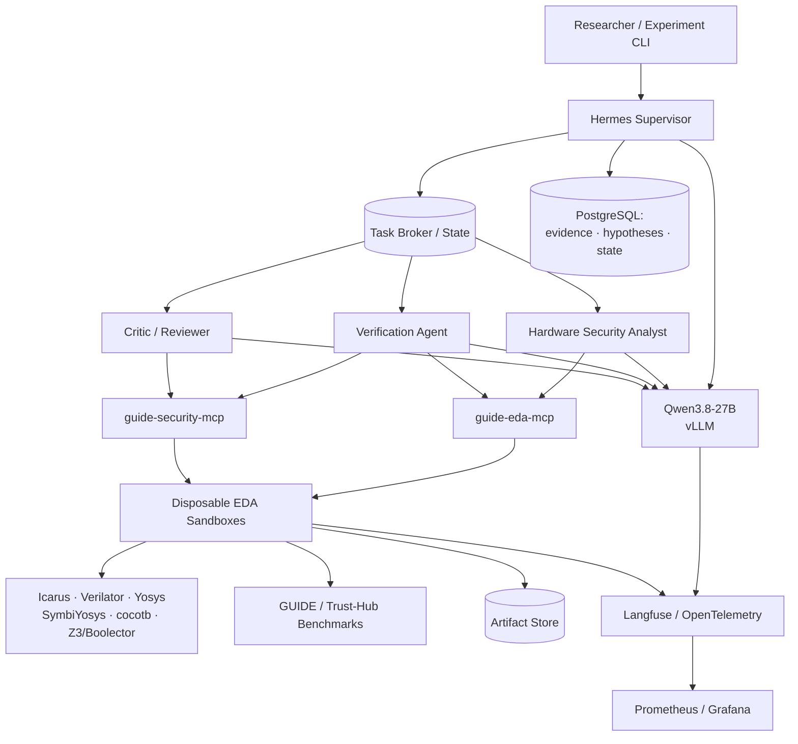
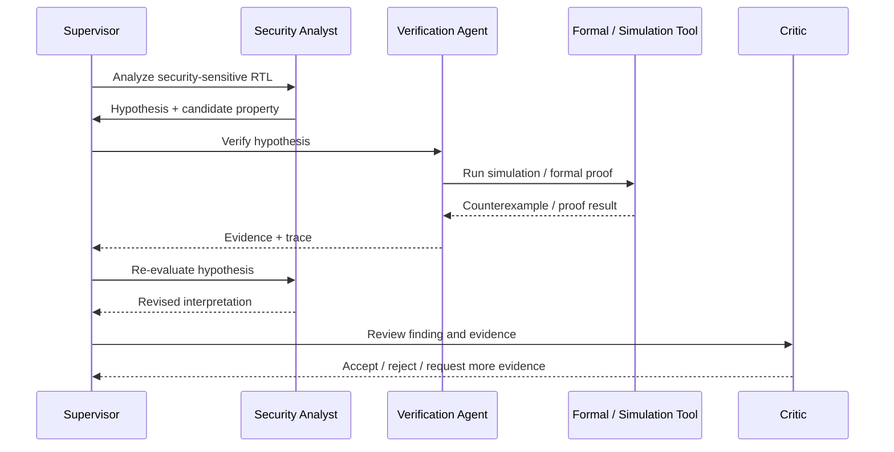
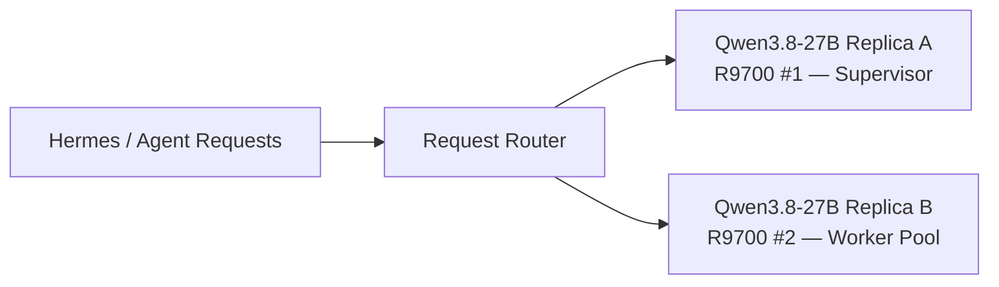

# LLM4Security

**EDA-grounded multi-agent LLM orchestration for hardware security research.**

LLM4Security is a local, reproducible research platform for evaluating **multi-agent LLM orchestration in hardware-security workflows**. It is an independent framework designed to integrate with the [GUIDE](https://github.com/GUIDE-EDA/GUIDE) ecosystem — using GUIDE and Trust-Hub workloads as its initial evaluation suite, without assuming it lives inside a GUIDE checkout — while combining a Hermes-based orchestration layer, a local **Qwen3.8-27B** model, and MCP-wrapped EDA tooling to test whether specialized agent delegation with EDA-grounded feedback beats a single tool-using LLM.

The **Phase 1 reference implementation** runs on a single **AMD Radeon AI PRO R9700 (32 GB)**. Qwen3.8-27B inference and a single Hermes agent's compile/simulate workflow have been validated; see the [deployment record](docs/r9700-deployment.md). The Supervisor and specialist-agent topology below is planned. A later **2× R9700** deployment (see [Scale-Out](#scale-out-dual-r9700)) can add a second model replica for higher concurrency and independent-verifier experiments after the single-agent baseline is measured.

> **Core principle: Agents propose; tools decide.**
> The LLM hypothesizes vulnerabilities and drafts security properties, but simulation, synthesis, and formal verification — run in disposable sandboxes — are what turn a hypothesis into a finding.

## Research Question

> Does specialized LLM orchestration with EDA-grounded feedback improve hardware-security reasoning compared with a single tool-using LLM, under equal model and compute budgets?

The design deliberately separates three variables so ablations are controlled rather than end-to-end and opaque:

1. **Model capability** — fixed at Qwen3.8-27B across every agent
2. **Orchestration capability** — Hermes Supervisor + delegated specialists
3. **Hardware ground truth** — simulation, synthesis, formal verification, GUIDE/Trust-Hub tooling

## Architecture



The deployed research toolset exposes compilation and simulation through MCP and ephemeral Docker containers. The planned architecture adds role restrictions, task worktrees, Redis delegation, and PostgreSQL evidence/hypothesis state. These broker and multi-agent components are still scaffolds. See [Scale-Out](#scale-out-dual-r9700) for the proposed dual-GPU topology.

## Evidence-Grounded Workflow



No vulnerability is reported solely because the model finds it plausible — every finding needs a supporting tool trace.

### Task delegation format

Delegation is a structured job, not a chat turn — workers return evidence objects, not prose opinions. This is the planned schema (see [Status](#status)):

```json
{
  "task_id": "rtl-014",
  "agent": "rtl-analysis",
  "objective": "Determine how auth_success can become 1",
  "inputs": ["rtl/auth.v", "rtl/top.v"],
  "constraints": ["Do not modify source files", "Use simulation if static analysis is inconclusive"],
  "expected_output": {
    "findings": [],
    "evidence": [],
    "confidence": 0.0,
    "recommended_next_tasks": []
  }
}
```

The Supervisor keeps a running hypothesis ledger scored against evidence IDs — e.g. `H1: auth_success reachable through counter overflow [0.82]` backed by `E12`–`E14` — so a confidence score is always traceable to a specific tool trace, never a restated model opinion.

## Hardware Requirements

### Phase 1 — Reference Implementation

| Component | Reference setup |
|---|---|
| **GPU** | 1× Radeon AI PRO R9700 (32 GB) |
| **CPU** | Ryzen 3950X (16 cores / 32 threads) |
| **RAM** | 96 GB installed on Proxmox host; start with a 64 GB GPU guest |
| **Storage** | 2–4 TB NVMe |
| **Network** | 10 GbE preferred |
| **OS** | Ubuntu 24.04 |
| **GPU runtime** | ROCm |
| **Model** | Qwen3.8-27B, ~4-bit |
| **Serving** | vLLM |
| **Default context** | 64K validated on one R9700; one active sequence |
| **Concurrency** | 1 active generation initially |
| **Orchestration** | Hermes Agent |

A single GPU is primarily a **throughput constraint**, not a functional limitation — specialist agents are logical roles sharing one model endpoint, while EDA jobs run mainly on CPU resources. **RAM is not optional headroom:** the CPU simultaneously runs Verilator/Yosys compilations, formal solvers, container overhead, and PostgreSQL/MinIO, so a strong GPU paired with a weak CPU or insufficient RAM is a poor trade even at this scale.

See [Scale-Out: Dual-R9700](#scale-out-dual-r9700) for the Phase 2 configuration.

## Agent Topology

All four agents are logical roles sharing one model endpoint in Phase 1 (see Architecture above).

| Agent | Responsibilities |
|---|---|
| **Supervisor** | Interprets the task, builds the task DAG, delegates, tracks experiment state and token/tool budgets, reconciles conflicting conclusions, stores full trajectories. Never mutates the canonical GUIDE checkout. |
| **Hardware Security Analyst** | RTL comprehension, asset/trust-boundary identification, threat modeling, security hypothesis generation, candidate SVA/property drafting, Trojan-related analysis. |
| **Verification Agent** | Converts hypotheses into evidence: compiles RTL, runs testbenches/cocotb, drives Verilator/Icarus simulation and Yosys synthesis, launches formal proofs, analyzes counterexamples and waveforms. Strongly prefers structured MCP calls over shell access. |
| **Critic / Reviewer** | Independent, read-only review: challenges unsupported findings, detects hallucinated vulnerabilities, checks that tool evidence actually supports the claim, rejects incomplete verification. |

As throughput needs grow, the Analyst can later be split into RTL Analyst / Security Property Agent / Adversarial-Trojan Agent without changing the supervisor topology. See [Scale-Out](#scale-out-dual-r9700) for the Phase 2 independent-verifier deployment mode.

## Model Layer

| Setting | Value |
|---|---|
| Model | Qwen3.8-27B (fixed across all agents to avoid confounding orchestration results with model differences) |
| Quantization | ~4-bit |
| Context | 8K bring-up default; 64K is a separate hardware acceptance target |
| Serving | vLLM (primary), SGLang (comparison backend), llama.cpp (reference baseline) |
| Concurrency | 1–2 active generations initially |

For GUIDE tasks, prefer retrieval (module index, dependency graph, security metadata, prior tool results) over stuffing the whole repository into context.

**Optional efficiency track (separate from the core ablations):** the primary ablation plan below holds the model fixed by design, to isolate orchestration effects. As a distinct follow-on study, cheaper models can be tiered by task difficulty — 7B–14B for triage/log-parsing/simulation-running, 14B–27B for RTL/firmware reasoning, 27B reserved for the Supervisor, report synthesis, and independent verifier — to test whether orchestration quality substitutes for raw model size at lower compute cost. Keep this as its own ablation axis rather than mixing it into the model-fixed experiments.

## MCP Servers

Tools are wrapped in domain-specific MCP servers rather than giving the LLM raw shell access, for reproducibility and auditability.

### `guide-eda-mcp`

Implemented in disposable Docker containers: `compile_rtl()` and `simulate()` (see [Phase 1](docs/phase1.md)). Full planned interface:
`lint_rtl()`, `compile_rtl()`, `simulate()`, `run_cocotb()`, `synthesize()`, `get_netlist_stats()`, `prove_property()`, `find_counterexample()`, `parse_vcd()` (JSON or rendered PNG for multimodal review), `compare_outputs()`

### `guide-security-mcp`

Planned operations, wrapping existing GUIDE/Trust-Hub research units:
`load_trusthub_case()`, `enumerate_security_assets()`, `load_known_trojan_metadata()`, `evaluate_trojan_detection()`, `calculate_detection_metrics()`, `run_security_assertions()`, `run_locking_validation()`, `compare_clean_vs_modified_netlist()`

Potential downstream integrations: GHOST, ATTRITION, NOODLE, TrojanLoC, LockForge, SALAD, LLMPirate.

## GUIDE Integration

LLM4Security is maintained as a standalone repository and should **not vendor GUIDE**. It locates GUIDE (and other benchmarks) through a configurable path:

```bash
export GUIDE_ROOT=/path/to/GUIDE
```

```yaml
# experiments/configs/local.yaml
benchmarks:
  guide:
    path: ${GUIDE_ROOT:-../GUIDE}
```

A typical development layout is:

```text
~/research/
├── GUIDE/
└── LLM4Security/
```

This keeps the dependency direction one-way: LLM4Security knows how to consume GUIDE data and tools but never vendors GUIDE itself, so it can later target other RTL benchmarks (OpenTitan, Ibex, CVA6, custom designs) without changing its core architecture. GUIDE, in turn, can optionally include LLM4Security as a pinned Git submodule for reproducibility — the same way it already tracks GHOST, ATTRITION, NOODLE, LockForge, and Trust-Hub:

```bash
cd GUIDE
git submodule add https://github.com/<owner>/LLM4Security.git LLM4Security
git commit -m "Add LLM4Security orchestration framework"
```

A GUIDE release then pins a specific `LLM4Security @ <commit>`, so experiments refer to a fixed version of the orchestration code rather than whatever is on `main` that day — and there's no circular dependency, since GUIDE references LLM4Security via Git submodule while LLM4Security references GUIDE only via the runtime config path above.

## Repository Layout

```text
LLM4Security/
├── README.md
├── LICENSE
├── pyproject.toml
├── uv.lock
├── .env.example
├── .gitignore
├── docker-compose.yml   # Redis, PostgreSQL, Langfuse for local dev
│
├── agents/              # Supervisor, Analyst, Verifier, Critic prompts/configs
├── skills/              # rtl-analysis, security-assertions, formal-verification, trojan-analysis
├── guide_mcp/
│   ├── eda_server/
│   └── security_server/
├── broker/              # Redis task queue + PostgreSQL evidence/hypothesis store
├── experiments/
│   ├── configs/
│   ├── ablations/
│   └── benchmarks/
├── runner/
│   ├── experiment.py
│   ├── sandbox.py       # Docker container lifecycle
│   ├── metrics.py
│   └── artifacts.py
├── schemas/             # task.py, finding.py, evidence.py, verification.py
├── integrations/
│   └── guide/           # loader.py, paths.py — consumes GUIDE, never vendors it
├── containers/
│   ├── eda/
│   ├── formal/
│   └── agent/
├── tests/
└── results/
```

## Ablation Plan

Planned experiments hold model, quantization, context budget (64K after validation), and tool versions fixed across all configurations:

| Config | Model | Tools | Agents |
|---|---|---|---:|
| A — Baseline | Qwen3.8-27B | None | 1 |
| B — Tool-Augmented | Qwen3.8-27B | `guide-eda-mcp` | 1 |
| C — Basic Orchestration | Qwen3.8-27B + Hermes | EDA | 3 (Supervisor, Analyst, Verifier) |
| D — Full Orchestration | Qwen3.8-27B + Hermes | EDA + Security | 4+ (adds Critic) |

**Metrics tracked:**
- Security finding accuracy, false-positive/false-negative rate
- SVA generation & formal verification success rate; Trojan detection pass@1 / pass@3
- Agent behavior: tool-call count, delegation count, disagreement, hypothesis revisions, evidence-backed finding rate
- Compute: tokens, GPU/CPU-seconds, wall-clock time, peak VRAM/RAM

## Sandboxing

Every delegated task gets an isolated environment: read-only GUIDE base checkout, a writable task-specific Git worktree, no inbound network, outbound disabled unless required, CPU/RAM quotas, wall-clock timeouts, and an explicit artifact output directory. Agents never mutate the canonical repository directly.

## Software Stack

- **Host:** Ubuntu 24.04, ROCm, Docker/Podman, Python 3.12, `uv`
- **Inference:** [vLLM](https://github.com/vllm-project/vllm) serving Qwen3.8-27B
- **Orchestration:** Hermes Agent, asyncio, Pydantic schema enforcement
- **EDA:** Icarus Verilog, Verilator, Yosys, SymbiYosys, cocotb, Z3, Boolector, Verible/Slang
- **Benchmarks:** GUIDE, Trust-Hub (GHOST, ATTRITION, NOODLE, LockForge, TrojanLoC)
- **Data:** PostgreSQL, optional MinIO
- **Observability:** OpenTelemetry, Langfuse, Prometheus, Grafana

## Scale-Out: Dual-R9700



The second GPU is a **scale-out upgrade**, not a prerequisite for Phase 1. Two homogeneous ROCm cards unlock configurations a single card can't:

- **Supervisor / worker-pool split** — the Supervisor gets a dedicated endpoint while the Analyst, Verifier, and Critic share a batched worker-model pool via vLLM's continuous batching, so specialist agents don't each need a dedicated GPU.
- **Independent-verifier mode** — for hallucination-focused ablations, run the Verification/Critic path against its own model replica rather than sharing a generation queue with the Analyst, so the verifier never shares reasoning context or sampling state with the agent it's checking.
- **64 GB combined pool** — an option for a larger model, if that becomes the priority instead of agent concurrency.

None of this requires an architecture change from Phase 1 — it's a routing/deployment change, not a redesign.

## Deployment Roadmap

1. **Inference** — bring up ROCm → vLLM → Qwen3.8-27B → OpenAI-compatible endpoint → Hermes on the Phase 1 single R9700; validate long-context generation and tool calling before any multi-agent logic.
2. **EDA MCP** — implement compile/lint/simulate/synthesize/cocotb/formal/counterexample tools; prove a *single* Hermes agent can inspect → propose → verify → revise before adding multi-agent logic.
3. **Sandboxing** — disposable containers, Git worktrees, timeouts, resource quotas, network restrictions. Execution environments (RTL sandboxes, etc.) get restricted API access to the inference endpoint only — never GPU passthrough or host shell access.
4. **Multi-agent delegation** — introduce Supervisor + Analyst + Verifier + Critic, routed through the Redis task broker rather than nested conversations.
5. **Experiment infrastructure** — PostgreSQL, artifact store, Langfuse/OpenTelemetry, Grafana, reproducible YAML configs.
6. **GUIDE benchmarks** — progress from security-property generation → small Trust-Hub designs → Trojan detection/localization → GHOST/ATTRITION-style adversarial workflows → LockForge experiments.
7. **Phase 2 scale-out** — once throughput, not capability, is the bottleneck, split Supervisor and worker-pool onto a second R9700 (or add worker replicas / heterogeneous model tiers); see [Scale-Out](#scale-out-dual-r9700) — the task-broker architecture requires no redesign to extend.

## Security & Isolation Considerations

- Restrict tool access by agent role; run all generated/tested code in sandboxes only
- Disable unnecessary network connectivity; pin benchmark and tool versions; record commit hashes
- Agents cannot alter baseline benchmark ground truth — keep read-only benchmark data separate from writable worktrees
- Enforce wall-clock and memory limits; maintain immutable experiment logs and full provenance for findings
- For adversarial Trojan experiments, use controlled GUIDE/Trust-Hub targets rather than arbitrary third-party RTL
- Execution environments never get GPU passthrough — they hold only restricted API access to the inference endpoints, keeping model serving centralized in dedicated AI-server hosts

## Example Research Questions

- Does specialist-agent delegation improve vulnerability detection over a single tool-using LLM?
- Does mandatory formal/simulation evidence reduce hardware-security false positives?
- Does an independent critic agent improve precision enough to justify its token/latency cost?
- Does structured MCP tool access outperform unrestricted shell access in reliability and reproducibility?
- Does multimodal waveform interpretation improve debugging over structured signal-transition summaries?
- Does an independent verifier on a separate model replica reduce hallucinated findings compared to a verifier sharing generation context with the Analyst?
- Does tiering cheaper models to easier subtasks (triage, log parsing, simulation-running) preserve finding quality while reducing GPU-seconds per run?

## Future Work

Worker-pool replica scaling · higher-precision or larger local models · RTL/security fine-tuning and LoRA from successful trajectories · agent-specific models and learned routing · automated benchmark generation · Trojan red-team/blue-team agent pairs · RTL repair agents · FPGA-in-the-loop verification · power/side-channel tooling · extending unit agents beyond RTL/Trojan detection into firmware reversing, protocol/JTAG analysis, and side-channel tooling for full hardware-security audits (a scope decision to make deliberately, not by accretion).

## Status

The **Phase 1 software path** is implemented: single-R9700 ROCm/vLLM configuration,
OpenAI endpoint acceptance checks, Hermes configuration, `guide-eda-mcp` stdio tools
for `compile_rtl()` and `simulate()`, and a bounded single-agent feedback loop.
See [Phase 1 deployment and validation](docs/phase1.md) for the 96 GB Proxmox host,
installation and tests, and the [deployment record](docs/r9700-deployment.md) for
measured context capacity and Hermes acceptance. A [synthetic authorization
baseline](docs/authorization-baseline.md) evaluates model verdicts against linked
tool evidence. Broker, multi-agent experiments, source editing, and other EDA
tools remain future work; a passing smoke test is not a hardware-security finding.

## License

See [LICENSE](LICENSE).

---

> **Use the LLM to generate, prioritize, and revise hypotheses; use hardware tools to establish ground truth.**
